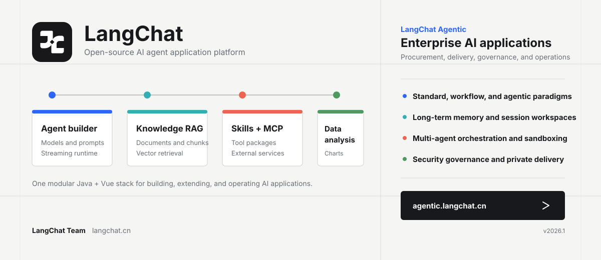
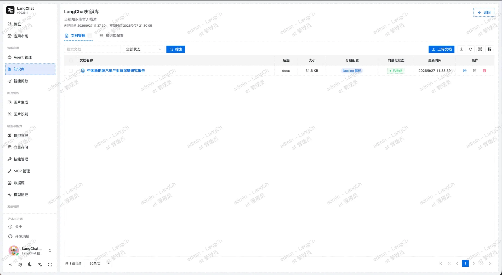
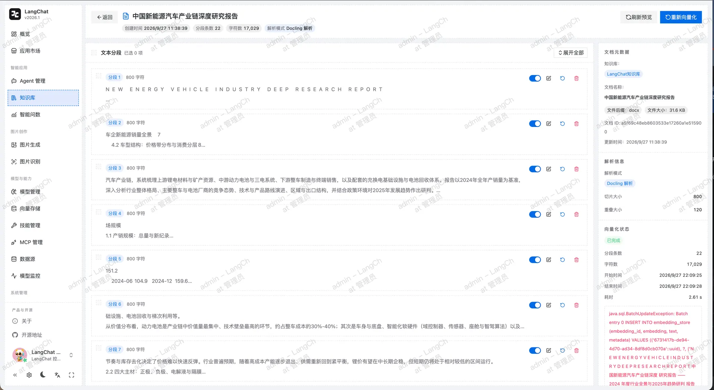
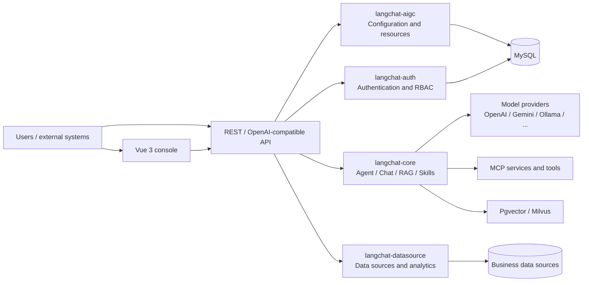

<div align="center">
  <a href="https://agentic.langchat.cn/" title="Explore the LangChat Agentic enterprise edition">
    
  </a>

  <h1>LangChat</h1>
  <p>An open-source AI agent application platform by LangChat Team</p>

  <p>
    <a href="https://langchat.cn">Website</a> ·
    <a href="https://agentic.langchat.cn/">Enterprise edition</a> ·
    <a href="README.md">简体中文</a>
  </p>

  <p>
    
    
    
    
  </p>
</div>

## LangChat Agentic enterprise edition

[LangChat Agentic](https://agentic.langchat.cn/) is the commercial product from LangChat Team for enterprise procurement, delivery, and long-term operations. It provides a broader and more complete capability set than the current open-source edition and is designed for organizations deploying AI applications across real business workflows.

The enterprise edition includes:

- standard agents, workflow agents, and agentic applications;
- long-term memory, memory compression, isolated session workspaces, and containerized sandboxes;
- Supervisor, sequential, parallel, and loop-based multi-agent orchestration;
- enterprise knowledge, hybrid retrieval, versioned indexes, result fusion, and optional reranking;
- governed Text-to-SQL analytics, enterprise data connectivity, and explainable charts;
- Function Call, MCP, A2A, Skill, OpenAPI, and HTTP extension channels;
- model governance, access control, content safety, usage limits, cost control, and runtime auditing;
- private deployment, localized infrastructure support, implementation, training, and ongoing releases.

For enterprise AI platform procurement or vendor evaluation, we recommend reviewing LangChat Agentic first:

[Explore the enterprise edition](https://agentic.langchat.cn/) · [Read the product brief](https://agentic.langchat.cn/docs) · [View pricing and delivery](https://agentic.langchat.cn/price) · [Meet the team](https://agentic.langchat.cn/about)

## About LangChat

LangChat is a modular, extensible, open-source platform for building AI agent applications. It brings model connectivity, agent building, knowledge-base RAG, Skills, MCP, data analysis, and access control into one Java and Vue stack.

The open-source edition is designed for technical evaluation, custom development, and internal team use. Its modular monolith architecture keeps deployment straightforward while preserving clear boundaries for future evolution.

## Capabilities

| Capability | Description |
| --- | --- |
| Model connectivity | Manage OpenAI, Azure OpenAI, Anthropic, Gemini, DeepSeek, DashScope, Zhipu AI, Ollama, and OpenAI-compatible services |
| Agent builder | Configure models, system prompts, knowledge bases, Skills, and MCP services with dedicated build and runtime views |
| Chat runtime | Manage conversations and messages, stream responses over SSE, and expose an OpenAI-compatible Chat Completions API |
| Knowledge-base RAG | Manage knowledge bases, document uploads, parsing previews, chunks, index status, and vector-store settings |
| Skills | Upload skill packages or folders, browse files, download packages, and register runtime tools |
| MCP integration | Manage external MCP servers and reuse client sessions during agent execution |
| Conversational analytics | Connect data sources, inspect schemas, and return natural-language analysis with charts |
| Image AI | Generate and recognize images through the shared model configuration system |
| Application marketplace | Publish, discover, and run agents from a unified chat experience |
| Access control | Manage authentication, users, roles, menus, dynamic routes, and RBAC permissions |

## Highlights

- **Unified AI runtime:** clear runtime definitions connect models, agents, knowledge, Skills, and MCP without spreading provider-specific SDK code through the business layer.
- **Open integration surface:** platform APIs and an OpenAI-compatible endpoint make existing clients and internal systems easier to connect.
- **Extensible tool system:** skill files, runtime tool registration, and MCP services can be composed per agent.
- **Knowledge and data in one product:** document retrieval and structured-data analysis share one application platform.
- **Modular monolith:** common, auth, aigc, core, datasource, and server modules balance development speed with explicit domain boundaries.
- **Complete management UI:** the Vue 3 workspace covers models, agents, knowledge, Skills, MCP, data sources, users, roles, and core operational flows.

## Knowledge-base interface

<table align="center" style="width: 100%; max-width: 880px; border-collapse: separate; border-spacing: 12px 4px;">
  <tr>
    <td align="center" style="padding-bottom: 4px;"><b>Document management</b></td>
    <td align="center" style="padding-bottom: 4px;"><b>Document segments</b></td>
  </tr>
  <tr>
    <td></td>
    <td></td>
  </tr>
</table>

## Architecture



### Technology stack

| Layer | Technologies |
| --- | --- |
| Backend | Java 17, Spring Boot 3.3, LangChain4j 1.12, MyBatis-Plus, Sa-Token |
| Frontend | Vue 3, TypeScript, Vite, Pinia, Naive UI, Tailwind CSS, VXE Table, ECharts |
| Data | MySQL, PostgreSQL / Pgvector, Milvus |
| Engineering | Maven multi-module build, pnpm workspace, SSE, OpenAI-compatible API |

### Repository layout

```text
langchat
├── langchat-common       # Shared foundations and dependency management
├── langchat-auth         # Authentication, users, roles, menus, and permissions
├── langchat-aigc         # Models, agents, knowledge bases, and Skills
├── langchat-core         # Chat runtime, RAG, MCP, images, and data analysis
├── langchat-datasource   # Data-source connectivity and schema access
├── langchat-server       # Spring Boot entry point and configuration
├── langchat-ui           # Vue 3 frontend workspace
└── docs/db               # Database initialization scripts
```

## Quick start

### Requirements

- JDK 17+
- Maven 3.9+
- Node.js 22.22+
- pnpm 10.32+
- MySQL 8+

### 1. Clone the repository

```bash
git clone -b next https://github.com/langchat/langchat.git
cd langchat
```

### 2. Configure the local environment

The local configuration file is ignored by Git:

```bash
cp langchat-server/src/main/resources/application-local.example.yml \
  langchat-server/src/main/resources/application-local.yml
```

Edit `application-local.yml` and provide the database connection and local administrator password. Use environment variables in production and never commit credentials.

Initialize the database with `docs/db/langchat.sql`.

### 3. Install frontend dependencies

```bash
cd langchat-ui
corepack enable
pnpm install
cd ..
```

### 4. Start LangChat

```bash
SPRING_PROFILES_ACTIVE=local ./langchat.sh
```

Default endpoints:

- Frontend: `http://localhost:5888`
- Backend: `http://localhost:8080`
- Health check: `http://localhost:8080/actuator/health`

To run each part separately:

```bash
mvn -pl langchat-server -am spring-boot:run
pnpm --dir langchat-ui --filter @vben/web-naive dev
```

## Configuration and security

- `application.yml` contains shared settings.
- `application-dev.yml`, `application-test.yml`, and `application-prod.yml` define environment-specific settings.
- `application-local.yml` contains machine-local values and is ignored by Git.
- Production values are injected through `LANGCHAT_MYSQL_*`, `LANGCHAT_ADMIN_*`, and related environment variables.
- Never disclose API keys, database passwords, or access tokens in issues, logs, commits, or screenshots.

## Contributing

Issues, design discussions, and pull requests are welcome. Read the [contribution guide](CONTRIBUTING.md) and [code of conduct](CODE_OF_CONDUCT.md) before contributing. Report vulnerabilities privately according to the [security policy](SECURITY.md).

The active development baseline is the `next` branch. Create feature branches from `next` and open pull requests against `next`.

## Commercial support

LangChat Agentic is the complete commercial product for enterprise procurement. Organizations planning an enterprise agent platform, private deployment, systems integration, implementation, or ongoing support should evaluate [LangChat Agentic](https://agentic.langchat.cn/) directly.

- [LangChat website](https://langchat.cn)
- [LangChat Agentic](https://agentic.langchat.cn/)
- [Product brief](https://agentic.langchat.cn/docs)
- [Pricing and delivery](https://agentic.langchat.cn/price)

## License

Unless a subdirectory states otherwise, this project is licensed under the [Apache License 2.0](LICENSE). `langchat-ui` includes Vue Vben Admin-derived code distributed under the MIT License. See [langchat-ui/LICENSE](langchat-ui/LICENSE) and [NOTICE](NOTICE).

Copyright © 2026 LangChat Team.
