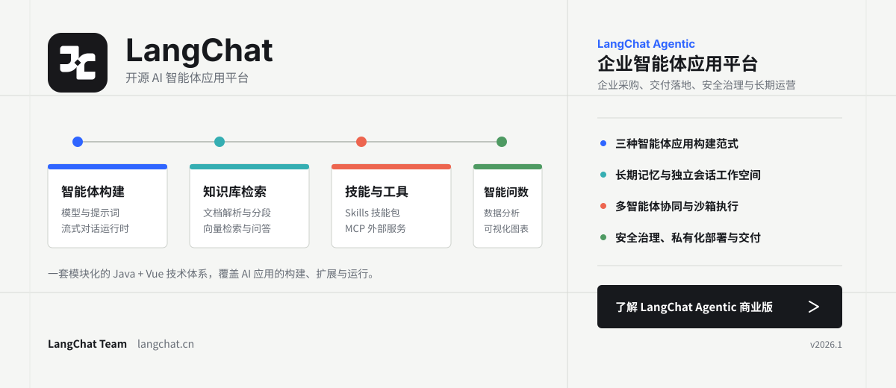
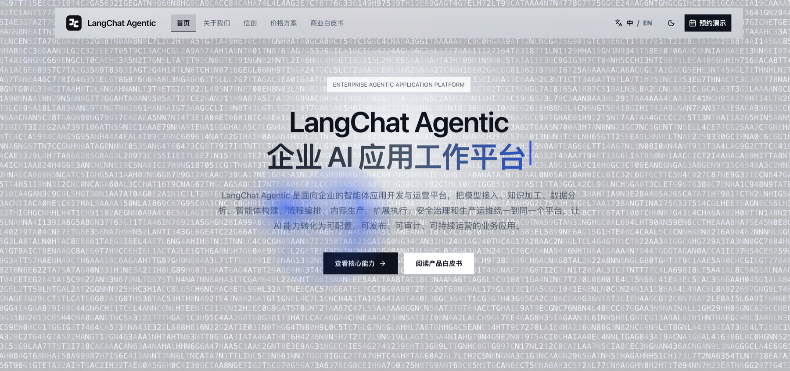
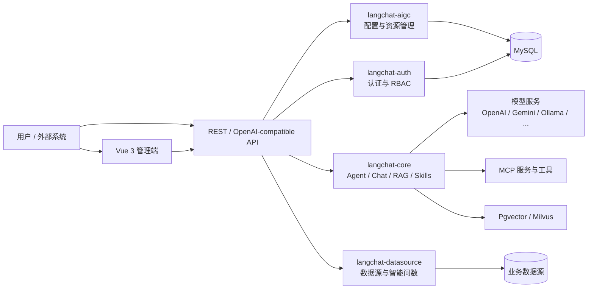

<div align="center">
  <a href="https://agentic.langchat.cn/" title="了解 LangChat Agentic 企业商业版">
    
  </a>

  <h1>LangChat</h1>
  <p>由 LangChat Team 开发的开源 AI Agent 应用平台</p>

  <p>
    <a href="https://langchat.cn">官网</a> ·
    <a href="https://agentic.langchat.cn/">企业商业版</a> ·
    <a href="README.en.md">English</a>
  </p>

  <p>
    
    
    
    
  </p>
</div>

## LangChat Agentic 企业商业版

[LangChat Agentic](https://agentic.langchat.cn/) 是 LangChat Team 面向企业采购、交付与长期运营推出的商业产品。商业版拥有比当前开源版本更丰富、完整的产品能力，适合需要将 AI 应用规模化部署到真实业务流程中的组织。

商业版主要提供：

- 标准智能体、工作流智能体与 Agentic 智能体三种应用构建范式；
- 长期记忆、记忆压缩、独立会话工作空间与容器化沙箱执行；
- Supervisor、顺序、并行和循环等多 Agent 协同编排；
- 企业知识库、混合检索、索引版本切换、融合排序与可选重排；
- 受控 Text2SQL 智能问数、企业数据源接入与可解释图表；
- Function Call、MCP、A2A、Skill、OpenAPI 与 HTTP 扩展通道；
- 模型治理、权限安全、内容安全、用量与成本控制、运行审计；
- 私有化部署、信创适配、实施交付、培训与持续版本服务。

<a href="https://agentic.langchat.cn/" title="访问 LangChat Agentic 企业商业版官网">
  
</a>

如果你正在进行企业级 AI 平台选型或采购，建议优先了解 LangChat Agentic：

[查看商业版完整能力](https://agentic.langchat.cn/) · [阅读商业白皮书](https://agentic.langchat.cn/docs) · [查看价格与交付方案](https://agentic.langchat.cn/price) · [了解团队](https://agentic.langchat.cn/about)

## 关于 LangChat

LangChat 是一个模块化、可扩展的开源 AI Agent 应用平台。它将模型接入、Agent 构建、知识库 RAG、Skills、MCP、数据分析和权限管理整合到同一套 Java 与 Vue 技术体系中，帮助开发者快速搭建可运行、可集成的 AI 应用。

开源版本适合技术验证、二次开发和团队内部场景建设。项目采用模块化单体架构，在保持部署简单的同时，为后续按领域拆分和能力扩展保留清晰边界。

## 功能体系

| 能力 | 说明 |
| --- | --- |
| 多模型接入 | 统一管理 OpenAI、Azure OpenAI、Anthropic、Gemini、DeepSeek、通义千问、智谱、Ollama 及 OpenAI 兼容服务 |
| Agent 构建 | 配置模型、系统提示词、知识库、Skills 与 MCP，提供构建、调试和运行界面 |
| 对话运行时 | 支持会话与消息管理、SSE 流式响应，并提供 OpenAI 兼容的 Chat Completions 接口 |
| 知识库 RAG | 管理知识库、文档上传、解析预览、分段、索引状态和向量存储配置 |
| Skills 扩展 | 支持技能包或文件夹上传、文件浏览、下载和运行时工具注册 |
| MCP 集成 | 管理外部 MCP 服务配置，并在 Agent 运行时复用客户端会话 |
| 智能问数 | 接入数据源、读取结构目录，以自然语言生成分析结果与图表 |
| 图像能力 | 提供图像生成与图像识别接口，复用统一模型配置体系 |
| 应用市场 | 发布和发现 Agent，并从统一聊天界面直接运行应用 |
| 权限与治理 | 提供登录、用户、角色、菜单、动态路由与 RBAC 权限管理 |

## 核心亮点

- **统一的 AI 运行时**：模型、Agent、知识库、Skills 与 MCP 通过清晰的运行时定义装配，降低业务代码对具体模型 SDK 的耦合。
- **开放的协议入口**：同时提供平台 API 与 OpenAI 兼容接口，便于现有客户端和内部系统接入。
- **面向扩展的工具体系**：技能文件、工具注册与 MCP 服务可以按 Agent 组合，适合持续接入企业工具和业务能力。
- **从知识到数据分析**：同一平台覆盖文档知识检索与结构化数据分析，减少多套 AI 工具之间的上下文割裂。
- **模块化单体架构**：后端按 common、auth、aigc、core、datasource、server 划分边界，兼顾开发效率与演进空间。
- **完整管理界面**：Vue 3 前端覆盖概览、模型、Agent、知识库、Skills、MCP、数据源、用户与角色等主要工作流。

## 技术架构



### 技术栈

| 层级 | 主要技术 |
| --- | --- |
| 后端 | Java 17、Spring Boot 3.3、LangChain4j 1.12、MyBatis-Plus、Sa-Token |
| 前端 | Vue 3、TypeScript、Vite、Pinia、Naive UI、Tailwind CSS、VXE Table、ECharts |
| 数据 | MySQL、PostgreSQL / Pgvector、Milvus |
| 工程 | Maven 多模块、pnpm workspace、SSE、OpenAI-compatible API |

### 项目结构

```text
langchat
├── langchat-common       # 公共基础能力与依赖管理
├── langchat-auth         # 认证、用户、角色、菜单与权限
├── langchat-aigc         # 模型、Agent、知识库、Skills 等业务管理
├── langchat-core         # 对话运行时、RAG、MCP、图像与数据分析
├── langchat-datasource   # 数据源接入、结构读取与查询能力
├── langchat-server       # Spring Boot 启动与应用配置
├── langchat-ui           # Vue 3 前端工作区
└── docs/db               # 数据库初始化脚本
```

## 快速开始

### 环境要求

- JDK 17+
- Maven 3.9+
- Node.js 22.22+
- pnpm 10.32+
- MySQL 8+

### 1. 获取代码

```bash
git clone -b next https://github.com/LangChat/langchat.git
cd langchat
```

### 2. 配置本地环境

本地配置文件已被 Git 忽略，不会被提交：

```bash
cp langchat-server/src/main/resources/application-local.example.yml \
  langchat-server/src/main/resources/application-local.yml
```

编辑 `application-local.yml`，填写数据库连接和本地管理员密码。生产环境请使用环境变量，不要将密码或密钥写入仓库。

数据库初始化脚本位于 `docs/db/langchat.sql`。

### 3. 安装前端依赖

```bash
cd langchat-ui
corepack enable
pnpm install
cd ..
```

### 4. 启动项目

```bash
SPRING_PROFILES_ACTIVE=local ./langchat.sh
```

默认地址：

- 前端：`http://localhost:5888`
- 后端：`http://localhost:8080`
- 健康检查：`http://localhost:8080/actuator/health`

也可以分别运行后端与前端：

```bash
mvn -pl langchat-server -am spring-boot:run
pnpm --dir langchat-ui --filter @vben/web-naive dev
```

## 配置与安全

- `application.yml` 保存通用配置。
- `application-dev.yml`、`application-test.yml` 和 `application-prod.yml` 对应不同运行环境。
- `application-local.yml` 仅用于本机真实配置，已加入 `.gitignore`。
- 生产环境配置通过 `LANGCHAT_MYSQL_*`、`LANGCHAT_ADMIN_*` 等环境变量注入。
- 不要在 Issue、日志、提交记录或截图中公开 API Key、数据库密码和访问令牌。

## 参与贡献

欢迎通过 Issue 报告问题、讨论设计或提出功能建议。提交代码前请阅读 [贡献指南](CONTRIBUTING.md) 与 [行为准则](CODE_OF_CONDUCT.md)。安全问题请按照 [安全政策](SECURITY.md) 私下报告。

当前开发基线为 `next` 分支，请基于该分支创建功能分支并向 `next` 提交 Pull Request。

## 商业支持

LangChat Agentic 是面向企业采购的完整商业产品。如果你的组织正在建设企业级智能体平台，或需要私有化部署、系统集成、实施交付与持续服务，建议直接评估 [LangChat Agentic](https://agentic.langchat.cn/)。

- [LangChat 官网](https://langchat.cn)
- [LangChat Agentic 产品介绍](https://agentic.langchat.cn/)
- [商业白皮书](https://agentic.langchat.cn/docs)
- [价格与交付方案](https://agentic.langchat.cn/price)

## 许可证

除子目录另有声明外，本项目基于 [Apache License 2.0](LICENSE) 开源。`langchat-ui` 包含基于 MIT License 分发的 Vue Vben Admin 相关代码，详情请参阅 [langchat-ui/LICENSE](langchat-ui/LICENSE) 和 [NOTICE](NOTICE)。

Copyright © 2026 LangChat Team.
